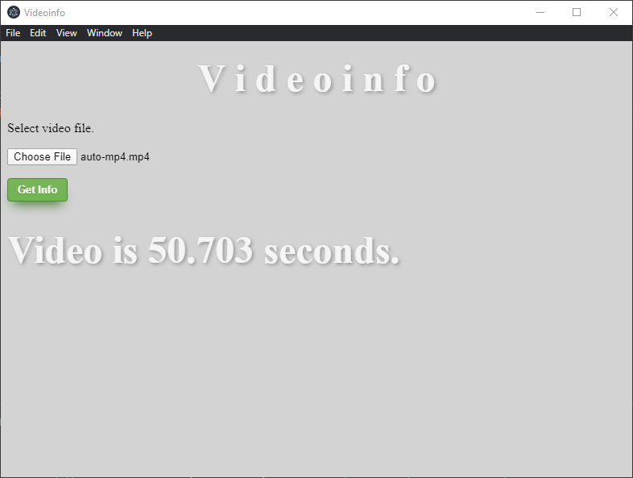

# mediainfo
Multimedia (Video + Audio) file format information.

## Run

`$ npm run mediainfo`

## Screenshot

## Reference

- [MediaInfo](https://mediaarea.net/en/MediaInfo)
- [FFMPEG](https://www.ffmpeg.org/)
